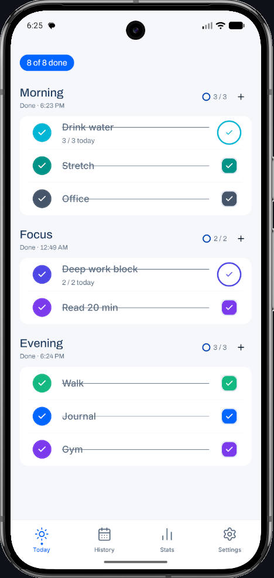
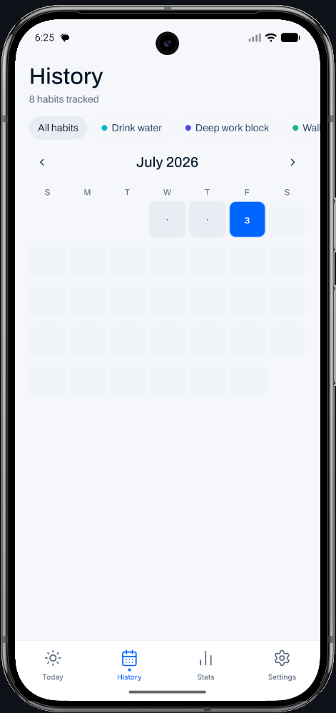
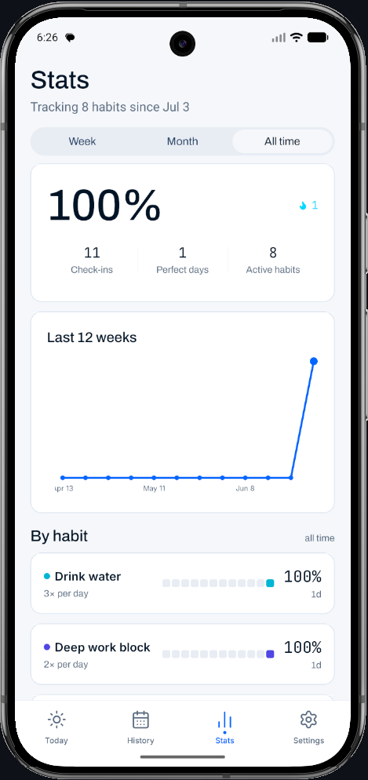
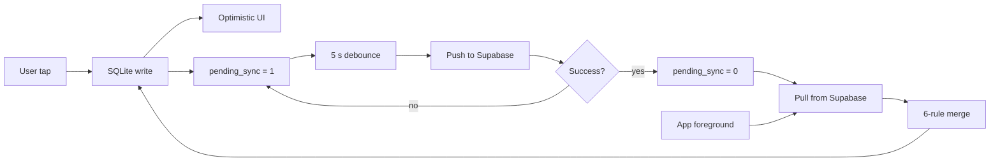

<div align="center">

<!-- TODO: Replace with actual logo once exported -->


# Dawnwell
**Website: https://dawnwell.vercel.app/**

**A daily ritual for tending to yourself.**

Offline-first habit tracker with custom sync engine. Built solo. Shipped to both stores.

<!-- TODO: Add actual App Store and Play Store URLs -->

[](https://github.com/dwakshar/dawnwell)
[](https://expo.dev)
[](./LICENSE)
[](https://apps.apple.com/app/dawnwell/TODO)
[](https://play.google.com/store/apps/details?id=app.dwakshar.dawnwell)

> **Status:** Shipped to Play Store + App Store on <!-- TODO: SHIP_DATE -->

</div>

---

## Screenshots

<table>
  <tr>
    <td align="center">
      
      <br />
      <sub>Today — your daily rituals</sub>
    </td>
    <td align="center">
      
      <br />
      <sub>History — heatmap + completion log</sub>
    </td>
    <td align="center">
      
      <br />
      <sub>Stats — streaks and weekly rhythm</sub>
    </td>
  </tr>
</table>

---

## Why This Project Exists

Most habit trackers are glorified to-do lists. Dawnwell is built around the idea of _rituals_: morning, focus, evening, custom — habits that belong together, checked in as a group, not a flat ticker of boxes. The mental model matters because it changes how you build the data layer, the UI, and the check-in interaction.

The deeper reason this project exists is to prove something specific about its author: that building a shipped mobile product solo — with a real sync engine, a real design system, and real distribution — is possible without a team behind it. The code in this repository reflects the decisions a senior engineer would make on a solo project: deliberate tradeoffs, typed from end to end, no shortcuts that would bite in production.

Dawnwell is a portfolio piece that is also a real app. That tension was the constraint that kept it honest.

---

## Key Engineering Decisions

This section is for developers and hiring managers who want to understand the technical substance behind the project, not just the feature list.

---

**Offline-first: SQLite is the source of truth, not the network**

Every interaction — creating a habit, logging a check-in, editing details — writes to local SQLite first. The UI updates optimistically. The network is never in the critical path. This means the app functions fully in airplane mode, at 6 AM on bad signal, or with Supabase down for maintenance.

- _Why not fetch-on-load?_ A spinner on every screen open is a broken product for a morning ritual app. SQLite gives sub-millisecond reads with no network round-trip.
- _Tradeoff:_ All sync complexity lives in the client. Every mutation must correctly set `pending_sync = 1` and every pull must run the merge algorithm. The payoff is that the user never waits.

---

**drizzle-orm over raw SQL or AsyncStorage**

Dawnwell's data is relational: rituals → habits → check-ins. AsyncStorage is a flat key-value blob with no join semantics. Raw SQL works but drifts from the TypeScript types as the schema evolves. Drizzle generates types from the schema definition; if a column is renamed or a table is dropped, the compiler errors before runtime.

- _Why not Watermelon DB or Realm?_ Both are heavier, and Drizzle + expo-sqlite is the stack the Expo team ships examples for. Fewer moving parts on a solo project matters.
- _Tradeoff:_ Drizzle's query builder is occasionally less expressive than hand-written SQL for complex aggregations. Those cases use `db.run()` with a tagged template literal and explicit types.

---

**Custom LWW sync engine instead of a full CRDT**

Dawnwell is a single-user, multi-device app — not a collaborative document editor. A full CRDT (automerge, y.js) would add operation logs, tombstone management, and per-field vector clocks for a problem that doesn't require them. The realistic conflict is: edit a habit on your phone while offline, edit the same habit on your iPad online, reconnect. Both devices have the full edit; one is simply more recent.

The sync engine implements six merge rules evaluated in order:

| Rule | Condition                                   | Winner                                |
| ---- | ------------------------------------------- | ------------------------------------- |
| a    | Remote has `deleted_at`, local does not     | Remote                                |
| b    | Local has `deleted_at`, remote does not     | Local                                 |
| c    | Local pending + `local.updated_at` > remote | Local                                 |
| d    | Local pending + timestamps equal            | Higher version; remote on tie         |
| e    | Local pending + `local.updated_at` < remote | Remote — **genuine conflict**, logged |
| f    | Local `pending_sync = 0`                    | Remote always                         |

Rule (e) is the only true conflict. It increments a counter in `SyncResult.conflicts` — no data is ever silently dropped.

- _Tradeoff:_ LWW can lose a write if two devices edit the same habit within the same millisecond. In practice this doesn't happen for a single-user app. If it becomes a concern, the version integer provides a deterministic tiebreaker within the same timestamp.

---

**Push-before-pull sync ordering**

If pull ran first: remote state lands in the local database, and the pending local edit is now layered on top of a merged row. Push then sends that accidentally-merged row to the server — which is not LWW, it's an implicit merge.

Pushing first ensures the local edit reaches Supabase before the server's current state is used to update local. If the push succeeds, `pending_sync` is cleared before pull runs, so merge rule (f) applies cleanly. If the push fails, `pending_sync` remains set and rule (c) still correctly prefers the local edit.

- _Tradeoff:_ Failing pushes block the pull cycle until they succeed or time out. A 5s debounce prevents hammering the network on rapid edits.

---

**SYNC-EXCLUDE: device-local fields never leave the device**

`reminder_notification_id` on habits is scheduled by the OS notification APIs and is device-specific. A notification ID from your phone is meaningless — and destructive — on your iPad. The type system enforces this at the push boundary:

```ts
type RemoteHabit = Omit<Habit, 'reminderNotificationId' | 'pendingSync'>;
```

TypeScript errors if anyone tries to include device-local fields in a push payload. This is a pattern, not just a comment.

---

**Deferred realtime subscriptions**

Supabase Realtime would enable sub-second multi-device sync via Postgres `LISTEN/NOTIFY`. It was deliberately deferred for v1.1 because it adds connection lifecycle complexity (reconnect on foreground, backoff) that multiplexes awkwardly with the existing pull loop. Pull-on-foreground covers the primary use case: switching from phone to iPad and expecting your recent check-ins to appear. When realtime is added, it will coexist with pull (duplicate rows handled by merge) rather than replace it.

---

**Reanimated worklets for all animations**

All animations run on the native UI thread via JSI worklets — not the JS thread via the legacy `Animated` API. This means animations are not blocked by JavaScript execution: heavy React Query re-renders, Drizzle reads, or sync cycles do not cause dropped frames. Every animation is gated behind `useMotion()` which checks the system reduce-motion preference and collapses all durations to zero when it is set.

- _Tradeoff:_ Worklets cannot access JS-thread state directly. Data must be passed via shared values. This is occasionally verbose for complex state-driven animations.

---

## Tech Stack

| Layer          | Choice                                                           |
| -------------- | ---------------------------------------------------------------- |
| Framework      | React Native 0.85 (New Architecture enabled)                     |
| Toolchain      | Expo SDK 56                                                      |
| Routing        | Expo Router v4 — file-based, typed routes                        |
| Language       | TypeScript strict (`noImplicitAny`, `noUncheckedIndexedAccess`)  |
| Local DB       | expo-sqlite + drizzle-orm — relational queries, typed schema     |
| Fast KV        | react-native-mmkv — auth tokens, settings, sync timestamps       |
| App state      | Zustand 5 — auth, onboarding, theme, sync status                 |
| Server state   | TanStack Query 5 — habits, check-ins, stats; 30s staleTime       |
| Backend        | Supabase — auth (magic link), Postgres, Row Level Security       |
| Sync           | Custom LWW engine — 6-rule merge, push-before-pull, soft deletes |
| Animation      | Reanimated 4 + Gesture Handler 2 — native-thread worklets        |
| Bottom sheets  | @gorhom/bottom-sheet v5                                          |
| Notifications  | expo-notifications — local scheduled + push infrastructure       |
| Charts         | react-native-gifted-charts — history heatmap, streak stats       |
| Build / Submit | EAS Build + EAS Submit                                           |

---

## Architecture

Dawnwell is local-first: every user action writes to SQLite immediately, the UI updates optimistically, and a background sync engine reconciles with Supabase when the network is available. Supabase is the sync target, not the source of truth.



**Data flow in code:**

```
UI → lib/mutations/ → db/repos/ → SQLite (immediate)
                   → lib/sync/mark-pending (pending_sync = 1)
                   → lib/sync/engine.ts (schedulePush, 5s debounce)
                             → push.ts → Supabase
                             → pull.ts → merge.ts → SQLite
```

React Query wraps all reads (`lib/queries/`). After mutations, `queryClient.invalidateQueries` propagates updates to any mounted screen. The sync engine is invisible to the UI layer — it operates entirely below the query boundary.

---

## Features

### Habits

- Groups habits into Morning, Focus, Evening, and Custom rituals
- Creates, edits, and archives habits via a bottom sheet form (react-hook-form + zod)
- Sets per-habit reminder notifications with custom time and frequency
- Soft-deletes habits — deleted rows are tombstoned, never hard-removed
- Tracks completion streaks with grace-day logic (one miss does not reset a streak)

### Sync

- Syncs habits and check-ins across devices via a custom push/pull engine
- Resolves conflicts with last-write-wins + version tiebreaker (6 merge rules)
- Operates fully offline — all edits queue locally and push on reconnect
- Shows a persistent offline indicator when network is unavailable
- Displays sync status (last synced timestamp, in-progress, error) in the settings screen
- Excludes device-local fields (`reminderNotificationId`) from sync at the type level

### Notifications

- Schedules local push notifications per habit with configurable time
- Cancels and reschedules reminders automatically when a habit is edited or deleted
- Respects the in-app notifications toggle independently of OS permission state
- Uses a single `habit-reminders` notification channel on Android

### Settings

- Switches between system, light, and dark theme with an animated background transition
- Exports all habit and check-in data as JSON via the native share sheet
- Signs out and clears local auth tokens
- Initiates account deletion (Supabase-side cleanup runs via Edge Function in v1.1)

### Polish

- Check-in interaction: scale spring → tint fill → glow → checkmark entrance; haptic fires on tap
- All animations respect the system reduce-motion preference via `useMotion()`
- Every interactive element fires a contextual haptic (selection, impact, or notification)
- List items stagger on mount with a delay cap of 240ms (no item feels abandoned)
- Streak flame pulses slowly at 7–29 days; held still at 30+ (earned, not anxious)
- Theme transitions animate the background layer; content follows in the same render

---

## Design System

Dawnwell uses a cool deep-blue palette — near-black navy backgrounds (`#050814` dark, `#f5f7fa` light), electric blue accent (`#3b82f6` dark / `#0066ff` light), and a cyan highlight (`#22d3ee`) for data surfaces. The palette is dark-mode first: dark mode is the designed state; light mode is a faithful inversion. Typography pairs Archivo (display headings) with Inter (body and UI) and JetBrains Mono (numeric data). All tokens live in `theme/tokens.ts`; no color, radius, or spacing value is hardcoded outside it.

**Dark palette:**

| Token       | Hex       | Role                         |
| ----------- | --------- | ---------------------------- |
| `bg`        | `#050814` | App background               |
| `surface`   | `#0d1424` | Card / sheet background      |
| `surface-2` | `#131c33` | Elevated surface             |
| `accent`    | `#3b82f6` | Primary interactive          |
| `sage`      | `#22d3ee` | Data accent / secondary      |
| `ink`       | `#f1f5fb` | Primary text                 |
| `ink-mute`  | `#94a3b8` | Secondary / placeholder text |

For a detailed breakdown of animation timing, spring configs, haptics, and reduce-motion strategy, see [docs/motion-language.md](./docs/motion-language.md).

---

## Running Locally

### Prerequisites

- Node 18+
- npm or pnpm
- [Expo CLI](https://docs.expo.dev/get-started/set-up-your-environment/) (`npm install -g expo-cli`)
- iOS Simulator (macOS + Xcode) or Android emulator (Android Studio)
- A [Supabase](https://supabase.com) project with the migrations applied (see [docs/README-supabase.md](./docs/README-supabase.md))

### Steps

```bash
# 1. Clone
git clone https://github.com/dwakshar/dawnwell.git
cd dawnwell

# 2. Install dependencies
npm install

# 3. Configure environment
cp .env.example .env
# Fill in EXPO_PUBLIC_SUPABASE_URL and EXPO_PUBLIC_SUPABASE_ANON_KEY

# 4. Apply Supabase migrations
# See docs/README-supabase.md for the full setup walkthrough

# 5. Start the dev server
npx expo start
```

Press `i` for iOS Simulator, `a` for Android emulator, or scan the QR code with the Expo Go app.

**Store builds:** Dawnwell uses [EAS Build](https://docs.expo.dev/build/introduction/) for production binaries and [EAS Submit](https://docs.expo.dev/submit/introduction/) for store delivery. Run `eas build --platform all --profile production` once your environment variables are set in the EAS dashboard.

---

## Project Structure

```
app/            Expo Router file-based routes (tabs, settings, auth, onboarding)
components/     Shared UI components (primitives, habit cards, empty states)
lib/            Business logic: mutations, queries, sync engine, hooks, stores
db/             Drizzle schema, migrations, and repository functions
theme/          Design tokens (colors, spacing, radii, typography) + ThemeProvider
supabase/       SQL migrations and Edge Function stubs for the Supabase project
docs/           Architecture decision records and setup guides
assets/         Images, fonts, and static resources
```

---

## Roadmap

**v1.0 — shipped** <!-- TODO: SHIP_DATE -->

- **v1.1** — Realtime sync subscriptions (Supabase `LISTEN/NOTIFY` via websocket)
- **v1.1** — Full account deletion via Edge Function
- **v1.1** — iOS WidgetKit + Android App Widgets (today's ritual at a glance)
- **v1.2** — Apple Watch / Wear OS companion
- **v1.x** — Data import (JSON re-hydration from export)
- **v1.x** — Conflict UI: surface rule-(e) conflicts with keep-mine / keep-theirs prompt
- **deferred** — Premium tier (deferred until user count justifies the infrastructure)

---

## Case Study

For a deeper walkthrough of the architecture decisions, design process, and the tradeoffs that didn't make it into the code comments, read the full case study:

[aksharsharma.dev/dawnwell](https://aksharsharma.dev/dawnwell) <!-- TODO: Confirm URL is live -->

---

## Credits

Built by [Akshar Sharma](https://aksharsharma.dev) — [@dwakshar on GitHub](https://github.com/dwakshar) · [LinkedIn](https://linkedin.com/in/dwakshar) · [X / Twitter](https://x.com/dwakshar)

_Open to React Native roles at product-focused teams._

Dawnwell stands on the shoulders of excellent open-source work: [Expo](https://expo.dev), [Drizzle ORM](https://orm.drizzle.team), [Supabase](https://supabase.com), [Reanimated](https://docs.swmansion.com/react-native-reanimated/), and [@gorhom/bottom-sheet](https://ui.gorhom.dev/components/bottom-sheet). Thank you to the teams and contributors who maintain these.

---

## License

MIT — see [LICENSE](./LICENSE)
